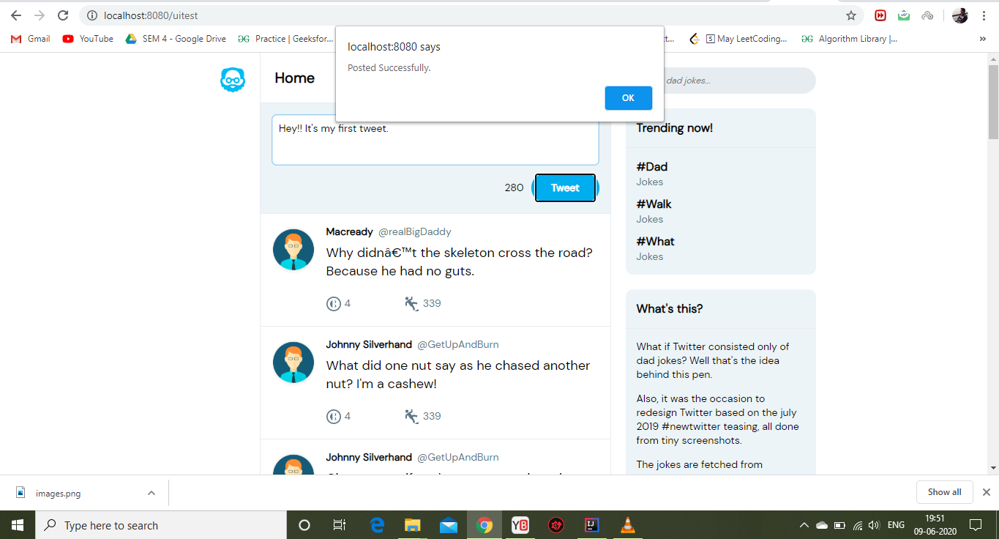

# :zap:Java Twitter Clone Project

* Simple full-stack website that displays a list of messages ('tweets') generated on the client side and processes them using backend JAVA. Future link to postgresql database to save tweets and general login information and passwords.

*** Note: to open web links in a new window use: _ctrl+click on link_**

## :page_facing_up: Table of contents

* [:zap:Java Twitter Clone Project](#zapjava=-twitter-clone-project)
	* [:page_facing_up: Table of contents](#page_facing_up-table-of-contents)
	* [:books: General info](#books-general-info)
    	* [:languages: Tools](#languages-tools)
	* [:camera: Screenshots](#camera-screenshots)
	* [:floppy_disk: Setup](#floppy_disk-setup)
	* [:cool: Features](#cool-features)
	* [:envelope: Contact](#envelope-contact)

## :books: General info

* A simplified Twitter clone using simple front and backends.Updated in Dec. 2020.

## :books: General info
* `HTML` `CSS` `Javascript` `JAVA` `Spring-MVC`. 

## :camera: Screenshots

.
.
.
.

## :floppy_disk: Setup

* From the `IntelliJ` directly set-up and run `Jetty`. Navigate to `http://localhost:8080/login/welcome`. The website needs to be manually reloaded if you make any requests. Navigate to `http://localhost:8080/uitest` to see tweets.

## :cool: Features

* A simple app with Java and Spring MVC.HTML, CSS and Javascript used to make frontend.

## :envelope: Contact

* you are welcome to [send me a message](https://instagram.com/divyansh2301)
